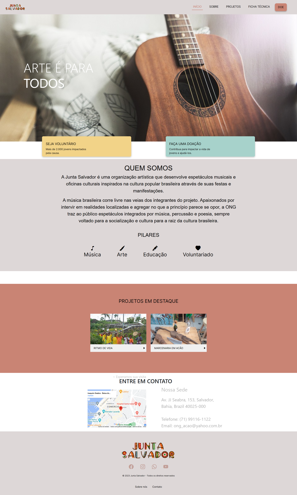
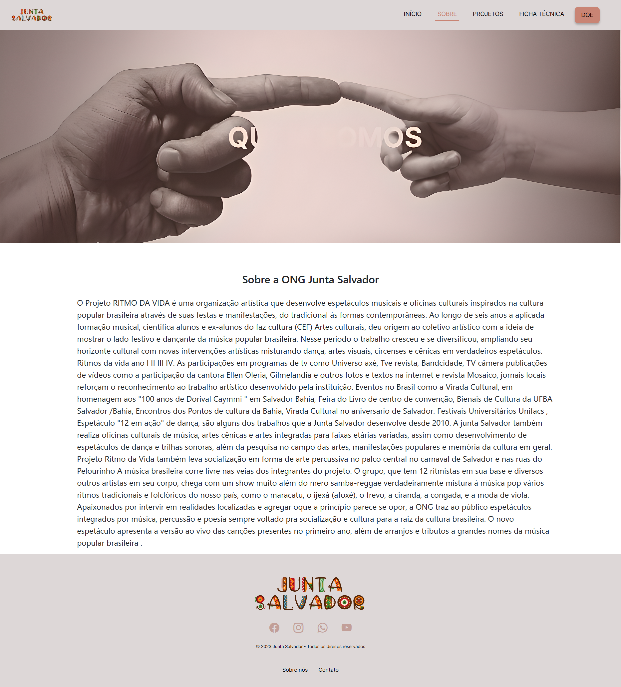
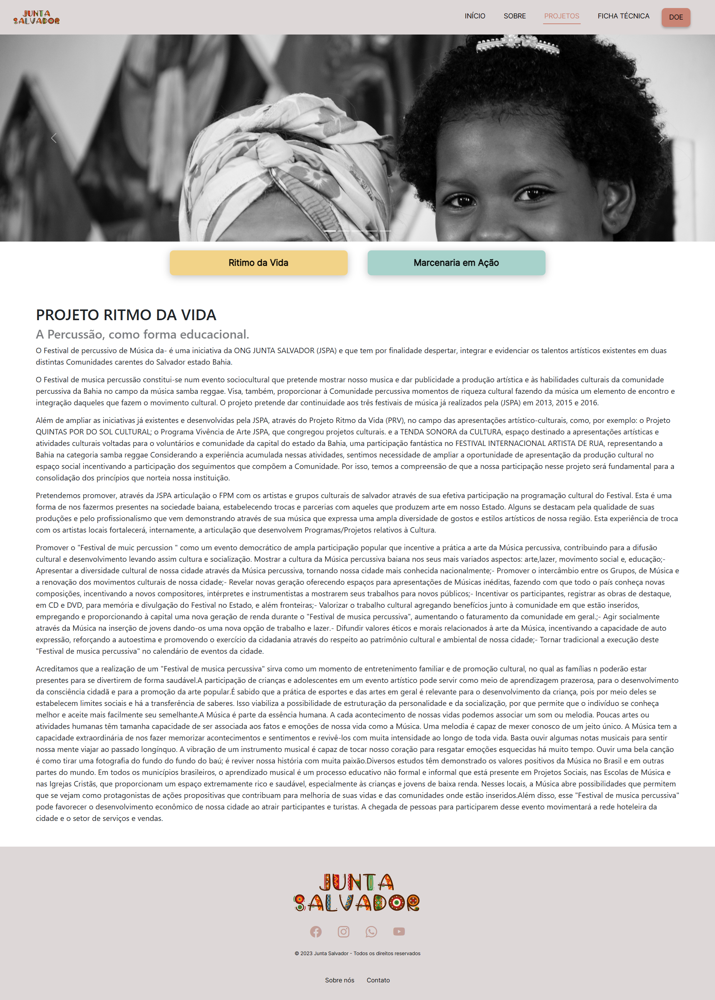
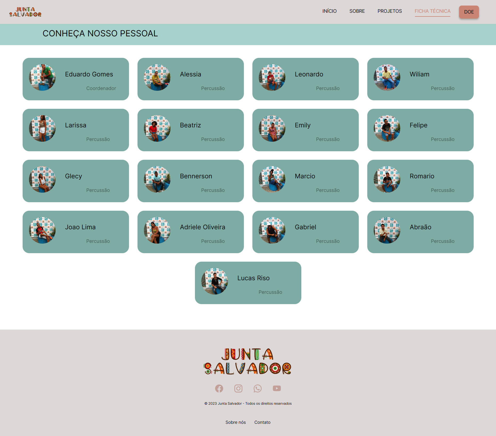
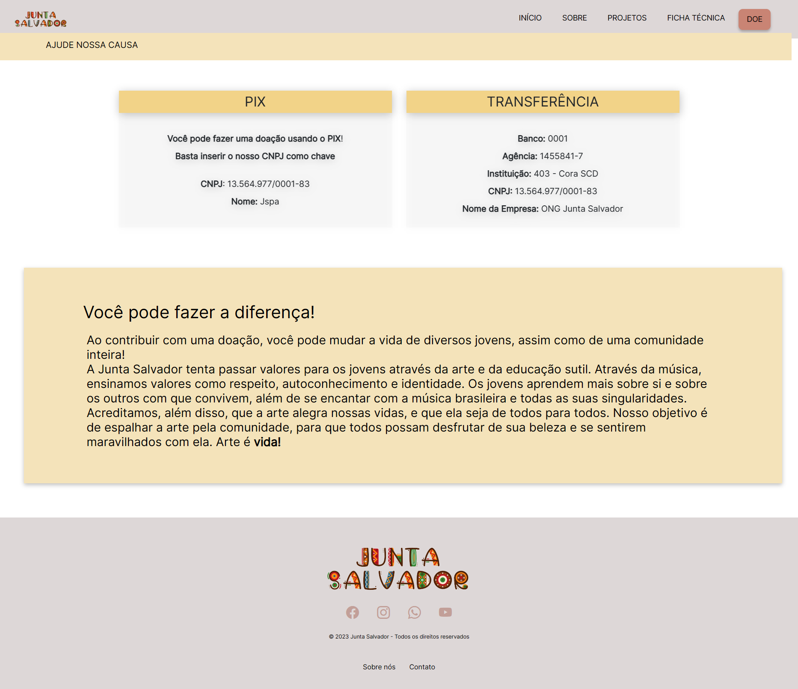

<h1 align="center">Projeto ORG Junta Salvador</h1>

A Junta Salvador é uma organização sem fins lucrativos dedicada a causas sociais e comunitárias. O projeto do site da Junta Salvador foi desenvolvido por voluntários chamados pela FreeHelper, uma empresa que mobiliza voluntários para desenvolver projetos para organizações sem fins lucrativos. 

<ul>
  <li><h3>Equipe de Desenvolvimento</h3></li>
  
O projeto foi desenvolvido por voluntários chamados pela FreeHelper, em parceria com a Junta Salvador.

- **Ricardo Rodrigues: [Acessar GitHub](https://github.com/Ricardo-Rodrigues0)**
- **Patrick Rodrigues: [Acessar GitHub](https://github.com/patrickrodrigue)**

</ul>
  
<ul>
  <li><h3>Tecnologias Utilizadas</h3></li>
  
O projeto foi desenvolvido utilizando as seguintes tecnologias:

  <ul>
    <li><b>HTML</b></li>
    <li><b>CSS</b></li>
    <li><b>JAVASCRIPT </li>
  </ul>
  
  </ul>

<ul>
  <li><h3>Esse site é dividido em 5 partes sendo elas;</h3></li>
  <ul>
    <li><b>Início</b></li>
    <li><b>Sobre</b></li>
    <li><b>Projetos</b></li>
    <li><b>Ficha Técnica</b></li>
    <li><b>Doe</b></li>
  </ul> 
  
Vamos está falando sobre cada parte individualmente.

</ul>

<ul>
  <li><h3>Início</h3></li>
  
Nesta página, você encontrará informações detalhadas sobre a organização Junta Salvador, sua missão, seus projetos em destaque e como se envolver. Há também dois botões principais:
  <ul>
<li><b>Seja um Voluntário: Ao clicar neste botão, você será redirecionado para um formulário onde pode se candidatar para ser voluntário na Junta Salvador.</b></li>
<li>Faça uma Doação: Ao clicar neste botão, você será redirecionado para uma página com informações sobre como fazer uma doação para a organização.</b></li>

</ul>

</ul>

<ul>
  <li><h3>Sobre</h3></li>
  
Nesta página, você encontrará informações mais detalhadas sobre a Junta Salvador, incluindo sua história, valores e objetivos.

</ul>

<ul>
  <li><h3>Projetos</h3></li>
  
Nesta página, são detalhados os projetos que a Junta Salvador está desenvolvendo atualmente. Cada projeto possui uma descrição detalhada, informações de progresso e imagens relacionadas.

</ul>

<ul>
  <li><h3>Ficha Técnica</h3></li>
  
Nesta página, são apresentados os participantes da organização Junta Salvador que contribuem para o desenvolvimento dos projetos. Cada participante é listado com seu nome e uma foto.

</ul>

<ul>
  <li><h3>Doações</h3></li>
  
Na última página, você encontrará informações sobre como fazer uma doação para a Junta Salvador. São fornecidos detalhes sobre métodos de pagamento e orientações para realizar uma contribuição.

</ul>

- **Conclusão**
  O projeto Junta Salvador foi desenvolvido com o objetivo de promover iniciativas sociais por meio de uma plataforma online. Utilizando tecnologias como HTML, CSS e JavaScript, criamos um site interativo que fornece informações sobre a organização, projetos em andamento e formas de contribuição. Os usuários podem se envolver, se tornando voluntários ou realizando doações para apoiar as causas da Junta Salvador. Para conhecer mais e participar, visite: [Junta Salvador](https://juntasalvador.netlify.app/home.html).

